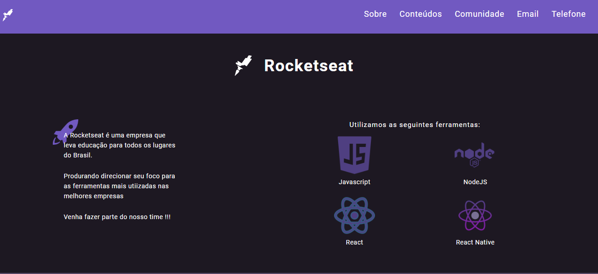
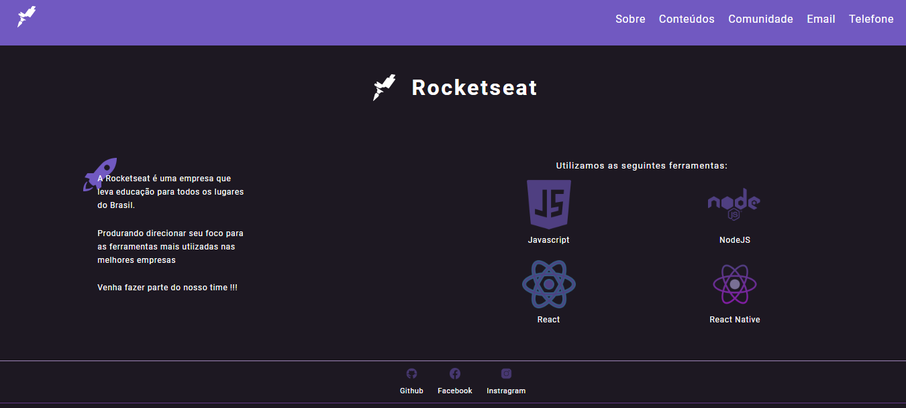
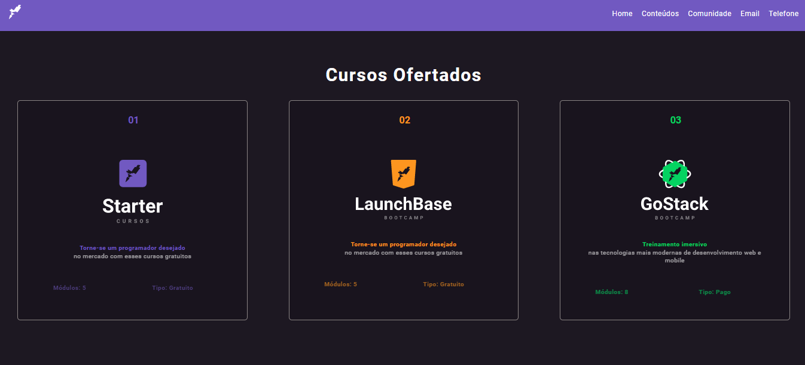
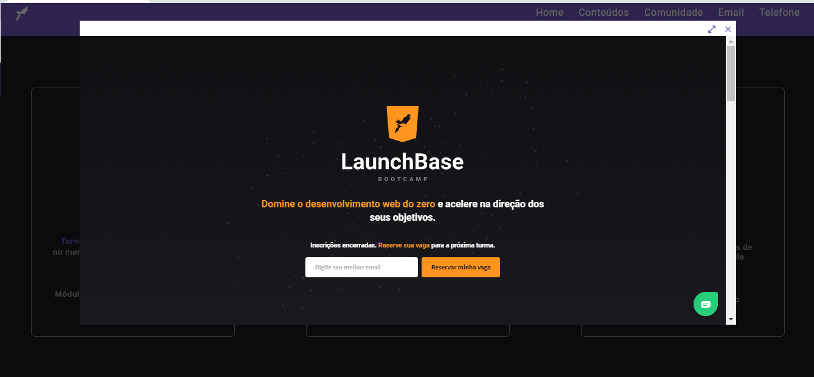
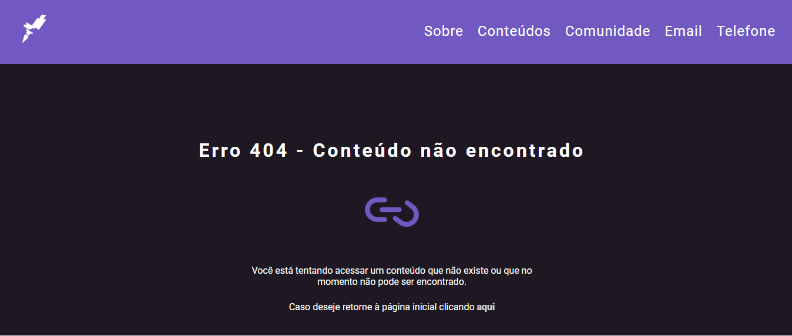

<h1 align="center">
  
  <h2 align="center"> Desafio </h2>
  <h2 align="center"> Módulo: Iniciando o Front-end </h2>
<h1>

# Índice

- [Sobre](#-sobre)
  - [Front-end](#-front-end)
  - [Back-end](#-back-end)
- [Tecnologias Utilizadas](#-tecnologias-utilizadas)
- [Imagens utilizadas](#-imagens-utilizadas)

---

## Sobre
O desafio consistiu em fazer um site para a Rocketseat. A primeira parte do desafio se dedicou a parte do front-end. Já a segunda parte foi voltada ao back-end

### Front-end

 #### 🛰  Deafio 2-1:
 A primeira parte consistiu em criar um arquivo html com um favicon da Rocketseat, e com um header contendo incialmente três links: Comunidade, Email e Telefone.

#### 🛰 Desafio 2-2
  A segunda parte consistiu em adicionar no Header um link "Sobre" e esta seção conteria informações sobre a Rocketseat, como nome e logo da empresa, descrição da empresa, tecnologias utilizadas.

🛰 Ainda na segunda parte do desafio, foi solicitado para adicionar os links para as redes sociais: Github, Facebook e Instagram da Rocketseat.

#### 🛰 Desafio 2-3
Adicionar no header um link com o nome "Conteúdos" . A página possui um grid com 3 divisões contendo os cursos disponíveis na Rocketseat: Starter, LauchBase e GoStack. Ao clicar em um dos cursos deve aparecer um modal com informações sobre o curso selecionado.

Cada card do curso contém: Logo do curso, título do curso, quantidade de módulos do curso e Informação se trata-se de um curso pago ou gratuito. O estilo dos cards foi baseado no próprio site da Rocketseat, com cores, formatos e disposição dos ícones.

O modal contém um iframe que busca a página do curso. Contém um botão de fechar, maximizar o modal.

### Back-end

#### 🛰 Desafio 3.1
Criar o servidor contendo duas rotas com os conteúdos desenvolvidos na parte do [front-end](#-front-end). Além da implementação de um arquivo padrão chamado layout.njk e um arquivo not-fount.njk que seria uma página de erro 404.

---

### Tecnologias utilizadas
Projeto desenvolvido com uso das seguintes ferramentas:
- HTML
- CSS
- Javascript

---

### Imagens utilizadas
As imagens utilizadas neste projeto foram obtidas nas seguintes fontes:

- [Rocketseat](https://rocketseat.com.br/)
 - <a target="_blank" href="https://icons8.com/icons/set/github">GitHub icon</a> icon by <a target="_blank" href="https://icons8.com">Icons8</a>
 - <a target="_blank" href="https://icons8.com/icons/set/facebook-new">Facebook icon</a> icon by <a target="_blank" href="https://icons8.com">Icons8</a>
 - <a target="_blank" href="https://icons8.com/icons/set/instagram-new">Instagram icon</a> icon by <a target="_blank" href="https://icons8.com">Icons8</a>
 - <a target="_blank" href="https://icons8.com/icons/set/javascript-logo">JavaScript Logo icon</a> icon by <a target="_blank" href="https://icons8.com">Icons8</a>
 - <a target="_blank" href="https://icons8.com/icons/set/nodejs">Nodejs icon</a> icon by <a target="_blank" href="https://icons8.com">Icons8</a>
 - <a target="_blank" href="https://icons8.com/icons/set/react">React icon</a> icon by <a target="_blank" href="https://icons8.com">Icons8</a>
 - <a target="_blank" href="https://icons8.com/icons/set/react-native">React Native icon</a> icon by <a target="_blank" href="https://icons8.com">Icons8</a>
 - <a target="_blank" href="https://icons8.com/icons/set/rocket">Rocket icon</a> icon by <a target="_blank" href="https://icons8.com">Icons8</a>
 - <a target="_blank" href="https://icons8.com/icons/set/1-c">Number 1 icon</a> icon by <a target="_blank" href="https://icons8.com">Icons8</a>
 - https://google.github.io/material-design-icons/
 - <a target="_blank" href="https://icons8.com/icons/set/broken-link">Broken Link icon</a> icon by <a target="_blank" href="https://icons8.com">Icons8</a>
---
Desenvolvido por ✨ Camila Almeida Diniz.
 
Curso: LaunchBase da [Rocketseat](https://rocketseat.com.br/)