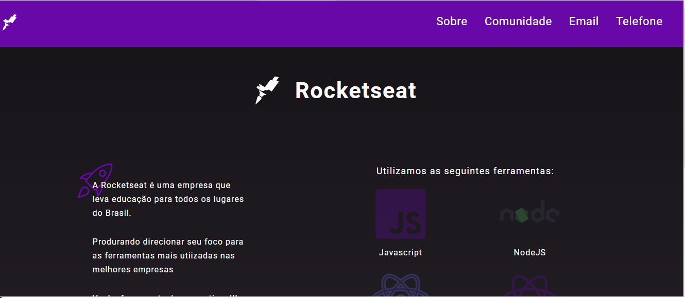
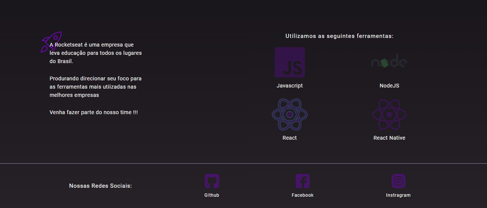

<h1 align="center">
  
  <h2 align="center"> Desafio </h2>
  <h2 align="center"> Módulo: Iniciando o Front-end </h2>
<h1>

# Índice

- [Sobre](#-sobre)
- [Tecnologias Utilizadas](#-tecnologias-utilizadas)
- [Imagens utilizadas](#-imagens-utilizadas)

---

## Sobre

 🛰 A primeira parte consistiu em criar um arquivo html com um favicon da Rocketseat, e com um header contendo incialmente três links: Comunidade, Email e Telefone.

 🛰 A segunda parte consistiu em adicionar no Header um link "Sobre" e esta seção conteria informações sobre a Rocketseat, como nome e logo da empresa, descrição da empresa, tecnologias utilizadas.

🛰 Ainda na segunda parte do desafio, foi solicitado para adicionar os links para as redes sociais: Github, Facebook e Instagram da Rocketseat.

---

### Tecnologias utilizadas
Projeto desenvolvido com uso das seguintes ferramentas:
- HTML
- CSS

---

### Imagens utilizadas
As imagens utilizadas neste projeto foram obtidas nas seguintes fontes:

- [Rocketseat](https://rocketseat.com.br/)
 - <a target="_blank" href="https://icons8.com/icons/set/github">GitHub icon</a> icon by <a target="_blank" href="https://icons8.com">Icons8</a>
 - <a target="_blank" href="https://icons8.com/icons/set/facebook-new">Facebook icon</a> icon by <a target="_blank" href="https://icons8.com">Icons8</a>
 - <a target="_blank" href="https://icons8.com/icons/set/instagram-new">Instagram icon</a> icon by <a target="_blank" href="https://icons8.com">Icons8</a>
 - <a target="_blank" href="https://icons8.com/icons/set/javascript-logo">JavaScript Logo icon</a> icon by <a target="_blank" href="https://icons8.com">Icons8</a>
 - <a target="_blank" href="https://icons8.com/icons/set/nodejs">Nodejs icon</a> icon by <a target="_blank" href="https://icons8.com">Icons8</a>
 - <a target="_blank" href="https://icons8.com/icons/set/react">React icon</a> icon by <a target="_blank" href="https://icons8.com">Icons8</a>
 - <a target="_blank" href="https://icons8.com/icons/set/react-native">React Native icon</a> icon by <a target="_blank" href="https://icons8.com">Icons8</a>

---
Desenvolvido por ✨ Camila Almeida Diniz.
 
Curso: LaunchBase da [Rocketseat](https://rocketseat.com.br/)